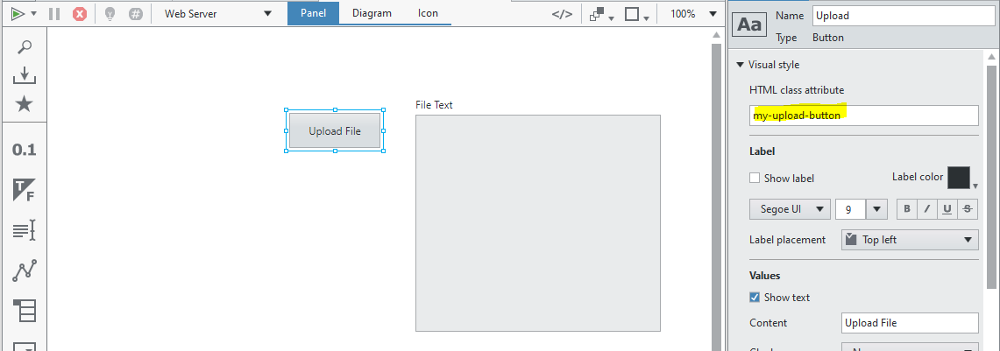

# DownloadUploadAFileWebVI
Library to upload or download a text file to and from a LabVIEW NXG WebVI. 

## Setup
1. Download the `Download Upload Library.gcomp` and place it in your Web Application project directory.

2. In LabVIEW NXG, include the `Download Upload Library.gcomp` in the project pane. From your block diagram you will now have access to `Download a File VI` and `Upload a File VI`.

## Using the `Upload a File VI`

1. Drop a control on the front panel (for example a button) and in the configuration pane set the `HTML class attribute` to a custom class, for example `my-upload-button`.

   

2. On the block diagram drop an `Upload a File VI` and into the selector terminal pass in the class name modified as a CSS selector. For example, the class name `my-upload-button` would become the selector string `.my-upload-button`. Notice the `.` prefix at the start of the class name.

   
